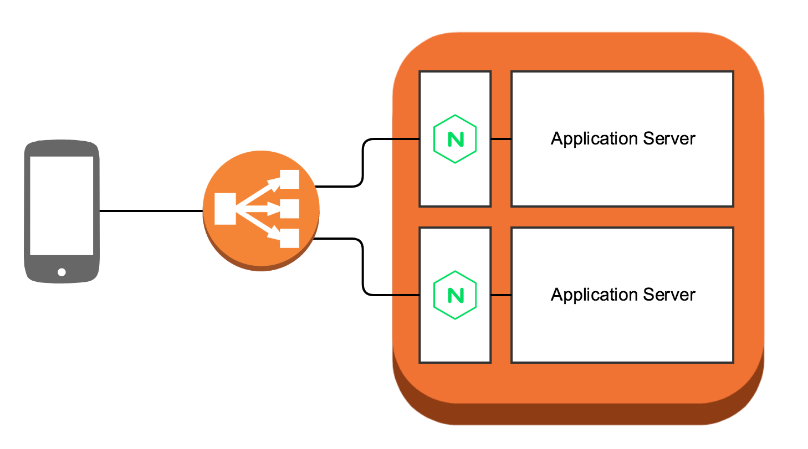

## NGINX Reverse Proxy on ECS

__Note: There is an updated version of this reference available at: ["NGINX reverse proxy sidecar for a web container hosted with Amazon ECS and AWS Fargate"](https://containersonaws.com/pattern/nginx-reverse-proxy-sidecar-ecs-fargate-task)__

__What is a reverse proxy?__ It is a server which fetches resources from another server on behalf of a client.

__Why use a reverse proxy?__ One of the challenges of running a web server that serves resources to the public is that you can expect to receive quite a lot of unwanted traffic every day. Some of this traffic is relatively benign scans by researchers and tools such as [Shodan](https://www.shodan.io/) or [nmap](https://nmap.org/):

```
[18/May/2017:15:10:10 +0000] "GET /YesThisIsAReallyLongRequestURLbutWeAreDoingItOnPurposeWeAreScanningForResearchPurposePleaseHaveALookAtTheUserAgentTHXYesThisIsAReallyLongRequestURLbutWeAreDoingItOnPurposeWeAreScanningForResearchPurposePleaseHaveALookAtTheUserAgentTHXYesThisIsAReallyLongRequestURLbutWeAreDoingItOnPurposeWeAreScanningForResearchPurposePleaseHaveALookAtTheUserAgentTHXYesThisIsAReallyLongRequestURLbutWeAreDoingItOnPurposeWeAreScanningForResearchPurposePleaseHaveALookAtTheUserAgentTHXYesThisIsAReallyLongRequestURLbutWeAreDoingItOnPurposeWeAreScanningForResearchPurposePleaseHaveALookAtTheUserAgentTHXYesThisIsAReallyLongRequestURLbutWeAreDoingItOnPurposeWeAreScanningForResearchPurposePleaseHaveALookAtTheUserAgentTHXYesThisIsAReallyLongRequestURLbutWeAreDoingItOnPurposeWeAreScanningForResearchPurposePleaseHaveALookAtTheUserAgentTHXYesThisIsAReallyLongRequestURLbutWeAreDoingItOnPurposeWeAreScanningForResearchPurposePleaseHaveALookAtTheUserAgentTHXYesThisIsAReallyLongRequestURLbutWeAreDoingItOnPurposeWeAreScann HTTP/1.1" 404 1389 - Mozilla/5.0 (Macintosh; Intel Mac OS X 10_11_1) AppleWebKit/537.36 (KHTML, like Gecko) Chrome/46.0.2490.86 Safari/537.36
[18/May/2017:18:19:51 +0000] "GET /clientaccesspolicy.xml HTTP/1.1" 404 322 - Cloud mapping experiment. Contact research@pdrlabs.net
```

But other traffic is much more malicious. For example here is what a web server sees while being scanned by the hacking tool [ZmEu](https://en.wikipedia.org/wiki/ZmEu_(vulnerability_scanner)) which scans web servers trying to find PHPMyAdmin installations to exploit:

```
[18/May/2017:16:27:39 +0000] "GET /mysqladmin/scripts/setup.php HTTP/1.1" 404 391 - ZmEu
[18/May/2017:16:27:39 +0000] "GET /web/phpMyAdmin/scripts/setup.php HTTP/1.1" 404 394 - ZmEu
[18/May/2017:16:27:39 +0000] "GET /xampp/phpmyadmin/scripts/setup.php HTTP/1.1" 404 396 - ZmEu
[18/May/2017:16:27:40 +0000] "GET /apache-default/phpmyadmin/scripts/setup.php HTTP/1.1" 404 405 - ZmEu
[18/May/2017:16:27:40 +0000] "GET /phpMyAdmin-2.10.0.0/scripts/setup.php HTTP/1.1" 404 397 - ZmEu
[18/May/2017:16:27:40 +0000] "GET /mysql/scripts/setup.php HTTP/1.1" 404 386 - ZmEu
[18/May/2017:16:27:41 +0000] "GET /admin/scripts/setup.php HTTP/1.1" 404 386 - ZmEu
[18/May/2017:16:27:41 +0000] "GET /forum/phpmyadmin/scripts/setup.php HTTP/1.1" 404 396 - ZmEu
[18/May/2017:16:27:41 +0000] "GET /typo3/phpmyadmin/scripts/setup.php HTTP/1.1" 404 396 - ZmEu
[18/May/2017:16:27:42 +0000] "GET /phpMyAdmin-2.10.0.1/scripts/setup.php HTTP/1.1" 404 399 - ZmEu
[18/May/2017:16:27:44 +0000] "GET /administrator/components/com_joommyadmin/phpmyadmin/scripts/setup.php HTTP/1.1" 404 418 - ZmEu
[18/May/2017:18:34:45 +0000] "GET /phpmyadmin/scripts/setup.php HTTP/1.1" 404 390 - ZmEu
[18/May/2017:16:27:45 +0000] "GET /w00tw00t.at.blackhats.romanian.anti-sec:) HTTP/1.1" 404 401 - ZmEu
```

In addition to hacking tools scanning your servers you can also end up receiving unwanted web traffic that is intended for another server. In a cloud environment your application may end up taking over an IP address that was formerly connected to another service. When this happens its not uncommon for misconfigured or misbehaving DNS servers to result in traffic that was intended to go to a completely different host to continue to be directed to an IP address which is now connected to your server.

It's the responsibility of anyone running a web server to handle and reject potentially malicious traffic or unwanted traffic, and ideally the web server is capable of rejecting this traffic as early as possible, before it actually reaches your core application code. A reverse proxy is one way to provide a layer of protection for your application server. It can be configured to reject these requests before they reach your application server.

For example the following NGINX configuration will automatically reject all requests that have unrecognized methods, and will return 404 for any request that does not match the pattern `/api`:

```nginx
http {
  # NGINX will handle gzip compression of responses from the app server
  gzip on;
  gzip_proxied any;
  gzip_types text/plain application/json;
  gzip_min_length 1000;

  server {
    listen 80;

    # NGINX will reject anything not matching /api
    location /api {
      # Reject requests with unsupported HTTP method
      if ($request_method !~ ^(GET|POST|HEAD|OPTIONS|PUT|DELETE)$) {
        return 405;
      }

      # Only requests matching the whitelist expectations will
      # get sent to the application server
      proxy_pass http://app:3000;
      proxy_http_version 1.1;
      proxy_set_header Upgrade $http_upgrade;
      proxy_set_header Connection 'upgrade';
      proxy_set_header Host $host;
      proxy_set_header X-Forwarded-For $proxy_add_x_forwarded_for;
      proxy_cache_bypass $http_upgrade;
    }
  }
}

```

This automatically rejects all of the unwanted traffic listed above before it reaches the application server, and instead the application server only receives traffic that was intended to reach the API that the application server is running.

In addition to protecting the application server from unwanted traffic the above NGINX configuration also has NGINX handle `gzip` encoding responses for clients. This offloads that CPU intensive task from the application server, allowing the application
 to focus on running the business logic. The same thing can also be done to offload SSL termination on NGINX.

This architecture reference shows how to deploy NGINX containers in front of your application containers on EC2 Container Service:



__How to deploy it on your own account:__

1. Build both containers:
   ```
   $ docker build -t reverse-proxy ./nginx
   $ docker build -t app ./app
   ```
3. Create EC2 Container Registries to push your containers to:
   ```
   $ aws ecr create-repository --repository-name reverse-proxy
   $ aws ecr create-repository --repository-name app
   ```
4. Authenticate with your new repository:
   ```
   $ `aws ecr get-login`
   ```
5. Tag your images and push them to the repositories. (You must put it your own repository URI from the `repositoryUri` value from step #3)
   ```
   $ docker tag reverse-proxy <reverse proxy repo uri>:revision_1
   $ docker push <reverse proxy repo uri>:revision_1
   $ docker tag app <app repo uri>:revision_1
   $ docker push <app repo uri>:revision_1
   ```
6. Modify `task-definition.json` with the the image URL's you just pushed to your ECR:
   ```json
    {
      "containerDefinitions": [
        {
          "name": "nginx",
          "image": "<your NGINX reverse proxy image URL here>",
          "memory": "256",
          "cpu": "256",
          "essential": true,
          "portMappings": [
            {
              "containerPort": "80",
              "protocol": "tcp"
            }
          ],
          "links": [
            "app"
          ]
        },
        {
          "name": "app",
          "image": "<your app image URL here>",
          "memory": "256",
          "cpu": "256",
          "essential": true
        }
      ],
      "volumes": [],
      "networkMode": "bridge",
      "placementConstraints": [],
      "family": "application-stack"
    }
   ```
   The above task definition will tells ECS to always launch the NGINX reverse proxy container, and the application container on the same instance, and to link them together. 
 
    The application container does not have a publically accessible port, so there is no way for a vulnerability scanning tool to directly access the application. Instead all traffic will be sent to NGINX, and NGINX is configured to only forward traffic to your application container, only if it follows specific whitelisted rules.

7. The final step is to deploy the task as a service, behind [a load balancer which is configured to send traffic to the NGINX container](http://docs.aws.amazon.com/AmazonECS/latest/developerguide/create-application-load-balancer.html).
